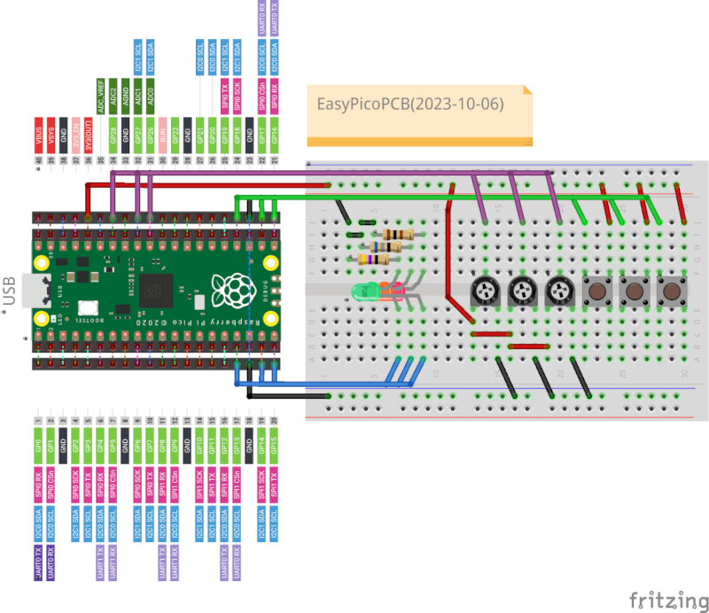
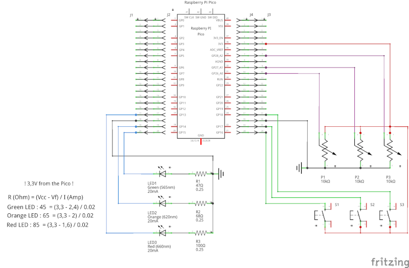
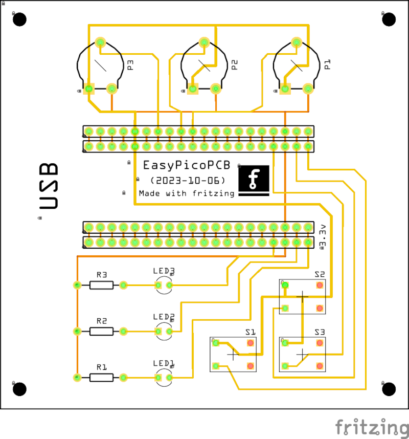
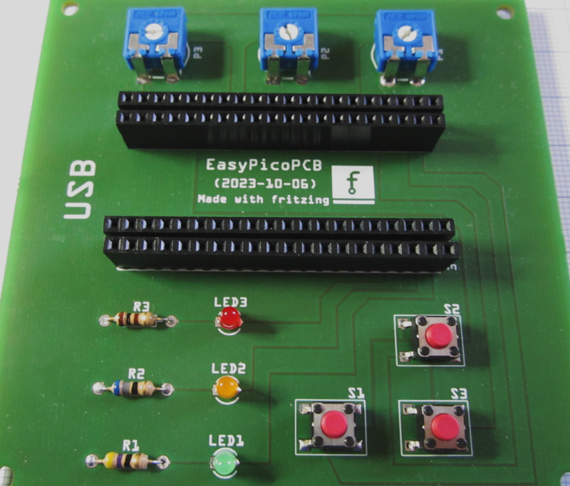
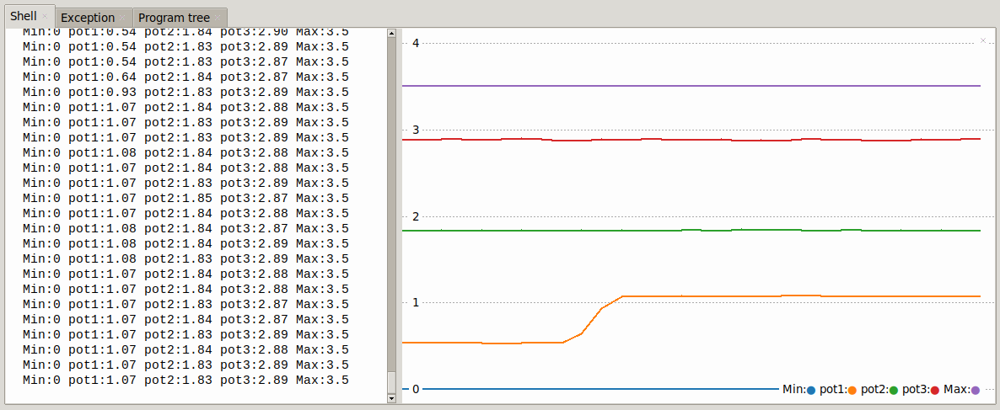

# EasyPicoPCB

A simple PCB with Raspberry Pi Pico, 3 LEDs, 3 push buttons, 3 potentiometers and a MicroPython code example.

The breadboard, the schematic and PCB are made with [Fritzing](https://fritzing.org/).





⚠️ The LEDs in the shematic and the PCB are in wrong polarity in this version. Be careful when soldering them. ⚠️



And the final result (PCB from [AISLER](https://aisler.net/) manufacture) with all components :



The Fritzing project [EasyPicoPCB_fritzing.fzz](EasyPicoPCB_fritzing.fzz) is a compressed file.

The code with Thonny IDE and its plotter window :

```python
# EasyPicoPCB (2024-04-22)
# Raspberry Pi Pico : https://www.raspberrypi.com/products/raspberry-pi-pico/
# Documentation, tutorials : https://projects.raspberrypi.org
# Book1 : https://hackspace.raspberrypi.com/books/micropython-pico
# MicroPython : https://micropython.org
# Thonny IDE : https://thonny.org
import machine
import utime

# External button S1 (GPIO16, pin 21)
buttonS1 = machine.Pin(16, machine.Pin.IN, machine.Pin.PULL_DOWN)
# External button S2 (GPIO17, pin 22)
buttonS2 = machine.Pin(17, machine.Pin.IN, machine.Pin.PULL_DOWN)
# External button S3 (GPIO18, pin 24)
buttonS3 = machine.Pin(18, machine.Pin.IN, machine.Pin.PULL_DOWN)

# External LED LED1 (GPIO15, pin 20)
led1 = machine.Pin(15, machine.Pin.OUT)
# External LED LED2 (GPIO14, pin 19)
led2 = machine.Pin(14, machine.Pin.OUT)
# External LED LED3 (GPIO13, pin 17)
led3 = machine.Pin(13, machine.Pin.OUT)
# Pico on-board LED (GPIO25)
ledOnboard = machine.Pin(25, machine.Pin.OUT)

# Potentiometer P1 (ADC0, GPIO26, pin31)
pot1 = machine.ADC(26)
# Potentiometer P2 (ADC1, GPIO27, pin32)
pot2 = machine.ADC(27)
# Potentiometer P3 (ADC2, GPIO28, pin34)
pot3 = machine.ADC(28)
# 3.3V from Pico (12 bits)
# See page 92, the analogue-to-digital converter in [Book1]
conversionFactor = 3.3 / (65535)

# Handler for buttons IRQ
def buttons_handler(pin):
    if buttonS1.value() == 1:
        _led1 = led1.value()
        if _led1 == 1:
            led1.off()
        else:
            led1.on()
    if buttonS2.value() == 1:
        _led2 = led2.value()
        if _led2 == 1:
            led2.off()
        else:
            led2.on()
    if buttonS3.value() == 1:
        _led3 = led3.value()
        if _led3 == 1:
            led3.off()
        else:
            led3.on()
            
# Blink LEDs (at startup for example)
def blink_all_leds(all_leds):
    for led in all_leds:
        # Check if the object is a LED
        if hasattr(led, "on"):
            led.on()
            utime.sleep(0.1)
            led.off()

# Buttons triggers
buttonS1.irq(trigger=machine.Pin.IRQ_RISING, handler=buttons_handler)
buttonS2.irq(trigger=machine.Pin.IRQ_RISING, handler=buttons_handler)
buttonS3.irq(trigger=machine.Pin.IRQ_RISING, handler=buttons_handler)

# Check all LEDs
blink_all_leds((led1, led2, led3, ledOnboard))

# Pico Status
ledOnboard.on()

# Show graphics in Thonny plotter with text values
while True:
    # https://mkaz.blog/code/python-string-format-cookbook/
    valueP1 = "pot1:{:.2f}".format(pot1.read_u16() * conversionFactor)
    valueP2 = "pot2:{:.2f}".format(pot2.read_u16() * conversionFactor)
    valueP3 = "pot3:{:.2f}".format(pot3.read_u16() * conversionFactor)
    print("Min:0", valueP1, valueP2, valueP3, "Max:3.5")
    utime.sleep(0.3)
```
<!-- MARKDOWN-AUTO-DOCS:START (CODE:src=https://github.com/Mick3DIY/EasyPicoPCB/blob/bc52c586c299dd3a9f334f90b4afb7bb0546a06d/EasyPicoPCB.py) -->
<!-- MARKDOWN-AUTO-DOCS:END -->



Happy coding & have fun ! :partying_face:
