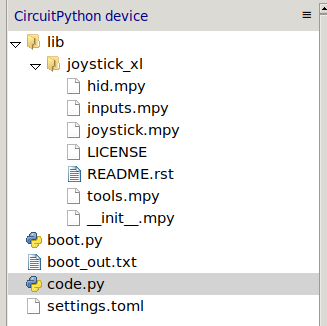
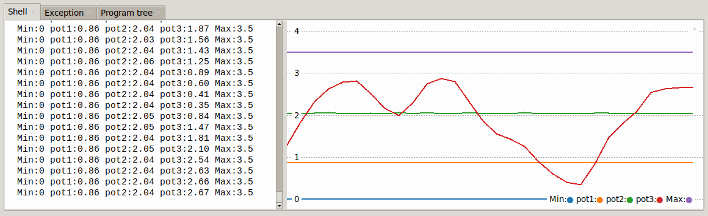
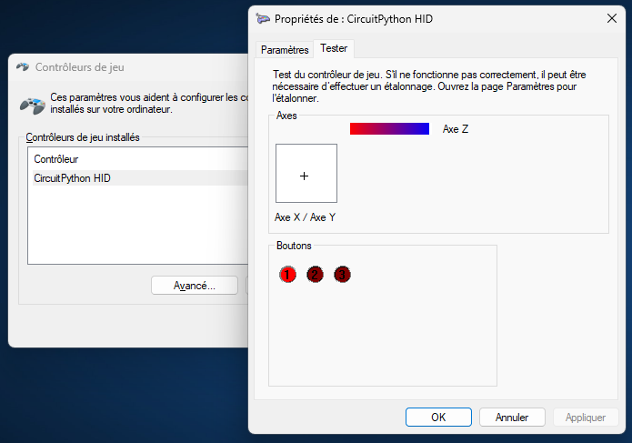
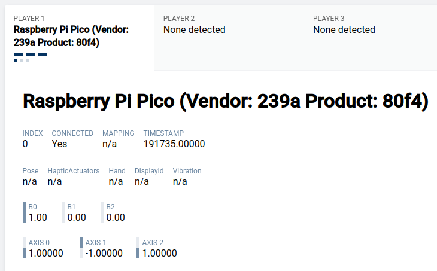

# EasyPicoPCB with JoystickXL

A simple PCB with Raspberry Pi Pico, 3 LEDs, 3 push buttons, 3 potentiometers and a code example in **CircuitPython** with **JoystickXL**. 

This is a updated version of the original code project : [https://github.com/Mick3DIY/EasyPicoPCB](https://github.com/Mick3DIY/EasyPicoPCB)

First of all, read carefully these chapters from JoystickXL documentation : Requirements, Limitations, Host OS/Software Compatibility in [https://circuitpython-joystickxl.readthedocs.io/en/latest/](https://circuitpython-joystickxl.readthedocs.io/en/latest/)

Then jump to the 'Getting Started' section : [https://circuitpython-joystickxl.readthedocs.io/en/latest/start.html](https://circuitpython-joystickxl.readthedocs.io/en/latest/start.html)

After verifying compatibility and checking all axes and buttons, adapt the file *boot.py* with this code :

```python
""" EasyPicoPCB and JoystickXL standard boot.py."""

import usb_hid  # type: ignore (this is a CircuitPython built-in)
from joystick_xl.hid import create_joystick

# This will enable all of the standard CircuitPython USB HID devices along with a
# USB HID joystick.
usb_hid.enable(
    (
        usb_hid.Device.KEYBOARD,
        usb_hid.Device.MOUSE,
        usb_hid.Device.CONSUMER_CONTROL,
        create_joystick(axes=3, buttons=3, hats=0),
    )
)
```

**Don't forget to reboot the Raspberry Pi Pico after create this file !**

Then create a new file *code.py* in the Pico board with Thonny IDE with the code below :



```python
# EasyPicoPCB code example in CircuitPython and JoystickXL (2024-02-16)
# Original project : https://github.com/Mick3DIY/EasyPicoPCB
# Raspberry Pi Pico : https://www.raspberrypi.com/products/raspberry-pi-pico/
# Documentation, tutorials : https://projects.raspberrypi.org
# CircuitPython : https://learn.adafruit.com/welcome-to-circuitpython
# JoystickXL : https://circuitpython-joystickxl.readthedocs.io
# Thonny IDE : https://thonny.org
import board
import time
import digitalio
import analogio

from joystick_xl.inputs import Axis, Button
from joystick_xl.joystick import Joystick

# External button S1 (GPIO16, pin 21)
buttonS1 = digitalio.DigitalInOut(board.GP16)
buttonS1.direction = digitalio.Direction.INPUT
buttonS1.pull = digitalio.Pull.DOWN
# External button S2 (GPIO17, pin 22)
buttonS2 = digitalio.DigitalInOut(board.GP17)
buttonS2.direction = digitalio.Direction.INPUT
buttonS2.pull = digitalio.Pull.DOWN
# External button S3 (GPIO18, pin 24)
buttonS3 = digitalio.DigitalInOut(board.GP18)
buttonS3.direction = digitalio.Direction.INPUT
buttonS3.pull = digitalio.Pull.DOWN

# External LED LED1 (GPIO15, pin 20)
led1 = digitalio.DigitalInOut(board.GP15)
led1.direction = digitalio.Direction.OUTPUT
# External LED LED2 (GPIO14, pin 19)
led2 = digitalio.DigitalInOut(board.GP14)
led2.direction = digitalio.Direction.OUTPUT
# External LED LED3 (GPIO13, pin 17)
led3 = digitalio.DigitalInOut(board.GP13)
led3.direction = digitalio.Direction.OUTPUT
# Pico on-board LED (GPIO25)
ledOnboard = digitalio.DigitalInOut(board.GP25)
ledOnboard.direction = digitalio.Direction.OUTPUT

# Potentiometer P1 (ADC0, GPIO26, pin31)
pot1 = analogio.AnalogIn(board.GP26)
# Potentiometer P2 (ADC1, GPIO27, pin32)
pot2 = analogio.AnalogIn(board.GP27)
# Potentiometer P3 (ADC2, GPIO28, pin34)
pot3 = analogio.AnalogIn(board.GP28)
# https://docs.circuitpython.org/en/latest/shared-bindings/analogio/index.html#analogio.AnalogIn
conversionFactor = pot1.reference_voltage / (65535)

js = Joystick()

js.add_input(
    Button(buttonS1, active_low=False), Button(buttonS2, active_low=False), Button(buttonS3, active_low=False),
    Axis(pot1), Axis(pot2), Axis(pot3),
)

# Pico Status
ledOnboard.value = True

# Show axis values or graphic lines in Thonny plotter with text values
while True:
    # External button S1
    if js.button[0].is_pressed:
        led1.value = True
    else:
        led1.value = False
    # External button S2
    if js.button[1].is_pressed:
        led2.value = True
    else:
        led2.value = False
    # External button S3
    if js.button[2].is_pressed:
        led3.value = True
    else:
        led3.value = False

    # Values from axis
    #print("Min:0", js.axis[0].value, js.axis[1].value, js.axis[2].value, "Max:255")
    
    # https://mkaz.blog/code/python-string-format-cookbook/
    valueP1 = "pot1:{:.2f}".format(pot1.value * conversionFactor)
    valueP2 = "pot2:{:.2f}".format(pot2.value * conversionFactor)
    valueP3 = "pot3:{:.2f}".format(pot3.value * conversionFactor)
    print("Min:0", valueP1, valueP2, valueP3, "Max:3.5")

    js.update()
    time.sleep(0.3) #Important !
```

Finally run this code to see some values :



Testing the board in Windows 11 with CircuitPython HID :



Or with a browser in the website : [https://hardwaretester.com/gamepad](https://hardwaretester.com/gamepad)



Happy coding & have fun ! :partying_face:
