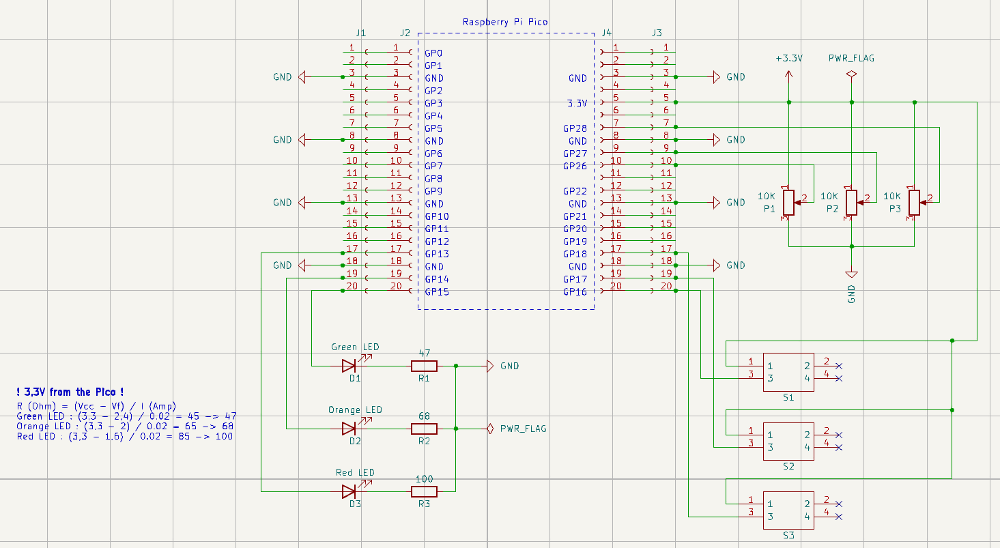
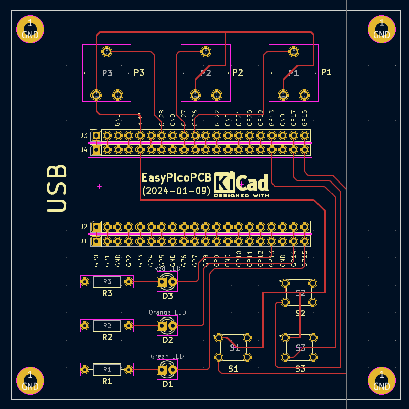
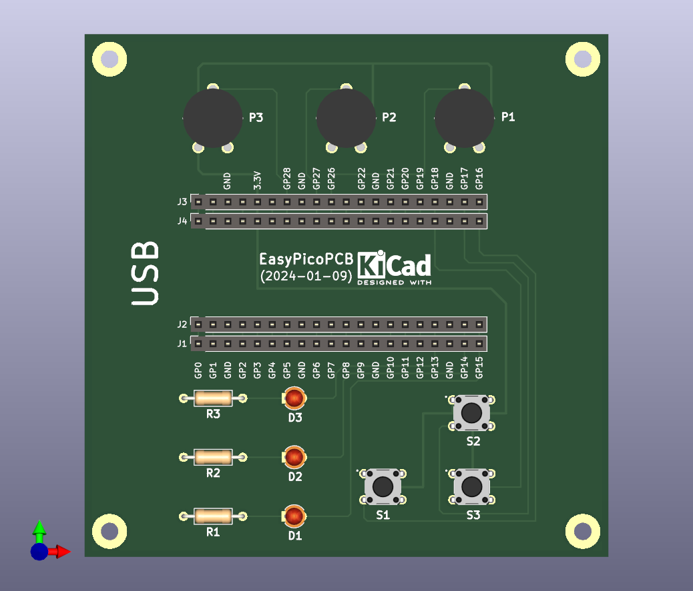

# EasyPicoPCB (KiCad Version)

This is a updated version of the original project : [https://github.com/Mick3DIY/EasyPicoPCB](https://github.com/Mick3DIY/EasyPicoPCB)

A simple PCB with Raspberry Pi Pico, 3 LEDs, 3 push buttons, 3 potentiometers and a MicroPython code example.

The schematic and PCB are made with [KiCad](https://www.kicad.org) version 6.

Bill Of Materials (BOM) :

| Ref  | Qty | Value | Cmp name | Footprint | Description |
| ------------- | ------------- | ------------- | ------------- | ------------- | ------------- |
| D1 | 1  | Green LED   | LED  | LED_THT:LED_D3.0mm  | Light emitting diode  |
| D2 | 1  | Orange LED  | LED  | LED_THT:LED_D3.0mm  | Light emitting diode  |
| D3 | 1  | Red LED     | LED  | LED_THT:LED_D3.0mm  | Light emitting diode  |
| H1, H2, H3, H4  | 4  | Hole_Pad  | MountingHole_Pad  | MountingHole:MountingHole_3mm_Pad  | Mounting Hole with connection  |
| J1, J2, J3, J4  | 4  | Conn_01x20_Female  | Conn_01x20_Female  | Connector_PinSocket_2.54mm:PinSocket_1x20_P2.54mm_Vertical  | Generic connector, single row, 01x20  |
| P1, P2, P3      | 3  | 10K | R_Potentiometer  | Samacsys:PT10LV10224A2020PMS  | Potentiometer  |
| R1 | 1  | 47   | R  | Resistor_THT:R_Axial_DIN0207_L6.3mm_D2.5mm_P10.16mm_Horizontal  | Resistor  |
| R2 | 1  | 68   | R  | Resistor_THT:R_Axial_DIN0207_L6.3mm_D2.5mm_P10.16mm_Horizontal  | Resistor  |
| R3 | 1  | 100  | R  | Resistor_THT:R_Axial_DIN0207_L6.3mm_D2.5mm_P10.16mm_Horizontal  | Resistor  |
| S1, S2, S3 | 3  | B3F-1000  | B3F-1000  | Samacsys:B3F1002  | OMRON ELECTRONIC COMPONENTS - B3F-1000 - SWITCH, SPNO, 0.05A, 24V, THT, 0.98N |

The MicroPython code is the same as the original version.

Happy coding & have fun ! :partying_face: