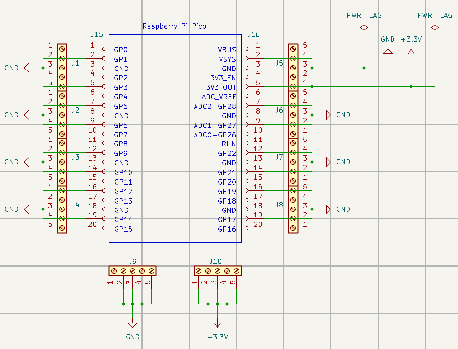
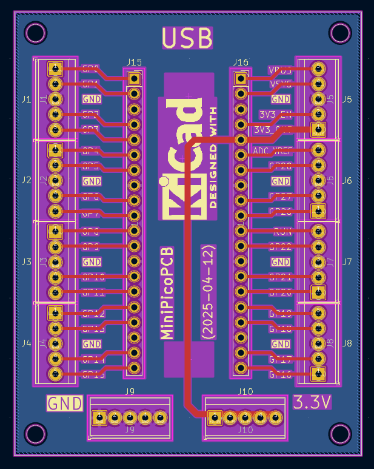
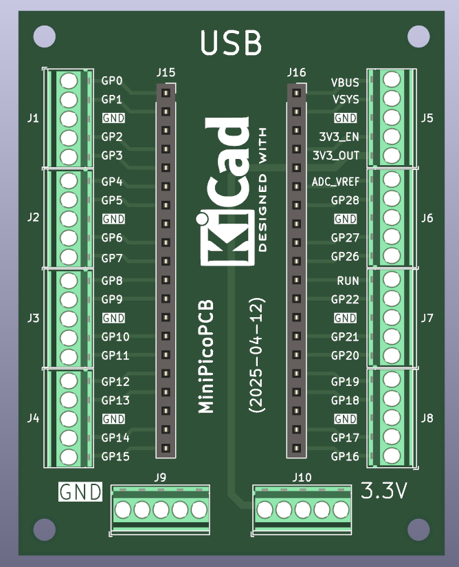

# MiniPicoPCB (KiCad Version)

A simple PCB for the Raspberry Pi Pico with screw terminal headers.

This is a updated version of the original code project : [https://github.com/Mick3DIY/EasyPicoPCB](https://github.com/Mick3DIY/EasyPicoPCB)

The schematic and PCB are made with [KiCad](https://www.kicad.org) version 8.

Bill Of Materials (BOM) :

| Ref  | Qty | Value | Cmp name | Footprint | Description |
| ------------- | ------------- | ------------- | ------------- | ------------- | ------------- |
| J1, J2, J3, J4, J5, J6, J7, J8, J9, J10  | 10  | Screw_Terminal_01x05 |TerminalBlock_TE_282834-5_1x05_P2.54mm_Horizontal | ...  | ...  |
| J15, J16  | 2  | Conn_01x20_Socket | PinSocket_1x20_P2.54mm_Vertical | Connector_PinSocket_2.54mm:PinSocket_1x20_P2.54mm_Vertical | Generic connector, single row, 01x20 |

Happy coding & have fun ! :partying_face:
